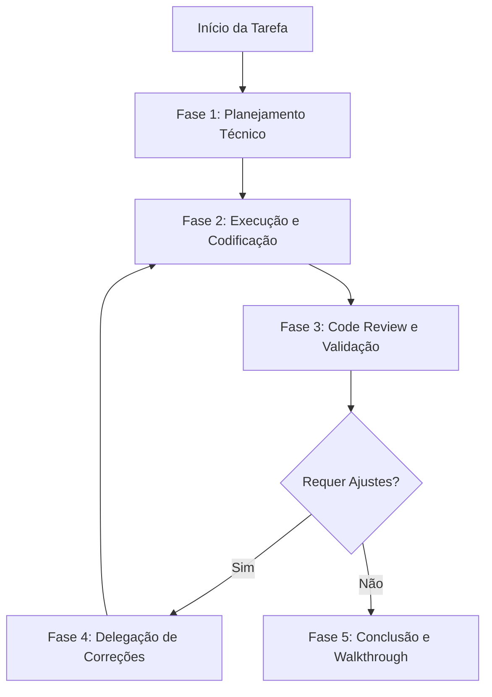

# Workflow: Desenvolvimento com Revisão Integrada

Este workflow define as etapas recomendadas para planejar, codificar, revisar e garantir a qualidade de entregas no projeto **Soda Cristal Tech App**, unindo planejamento técnico (TDD), revisão de código estrita (Code Review) e delegação de correções automáticas.

> **Referência do projeto**: `docs/soda-cristal-context.md`

---

## Estrutura do Workflow



---

## Detalhamento das Fases

### Fase 1: Planejamento Técnico (TDD)
1. **Acione a Skill**: Use a skill [tech-design-planner](file:///c:/bystartup/soda-app/.agent/SKILLS/tech-design-planner/SKILL.md).
2. **Elabore o TDD**: Escreva o documento detalhando a arquitetura, soluções consideradas, validações e riscos.
3. **Alinhamento**: Apresente o plano para o usuário no chat e aguarde a aprovação formal do plano antes de mexer em arquivos de código fonte.

### Fase 2: Execução e Codificação
1. **Desenvolvimento**: Desenvolva o código focado em um escopo limpo, modular e reutilizável.
2. **Convenções**: Respeite os padrões do projeto Soda Cristal:
   - `kebab-case` para nomes de arquivos
   - `PascalCase` para componentes React
   - `camelCase` para funções e variáveis
   - Stores Zustand: `use[Nome]Store`
3. **Arquitetura de Camadas**: Siga rigorosamente o fluxo:
   ```
   Presentation → Domain (services/stores) → Shared (API services) → Axios/API
   ```
   - Páginas em `src/presentation/pages/`
   - Componentes reutilizáveis em `src/presentation/components/`
   - Lógica de domínio em `src/domain/<domínio>/`
   - Serviços HTTP em `src/shared/api/services/`
   - Componentes genéricos (shadcn/ui) em `src/shared/ui/`
4. **Estilização**: Use exclusivamente Tailwind CSS + componentes shadcn/ui. Merge de classes com `cn()` de `@/shared/lib/utils`.
5. **Ícones**: Use apenas `lucide-react`.

### Fase 3: Code Review e Validação
1. **Acione a Skill**: Use a skill [code-review](file:///c:/bystartup/soda-app/.agent/SKILLS/code-review/SKILL.md).
2. **Rodar Validações**:
   - Execute no terminal: `npx tsc --noEmit`
   - Execute no terminal: `npm run build` (para alterações significativas)
3. **Testes E2E** (se aplicável):
   - Execute no terminal: `npm run test:e2e`
4. **Gerar Relatório**: O agente deve preencher a estrutura do relatório contendo os itens do checklist, os resultados das validações estáticas, resultados E2E e as observações.

### Fase 4: Delegação de Correções (Ciclo de Subagente)
*Se o relatório de revisão apontar pendências ou erros bloqueantes:*
1. **Invocar Subagente**: Utilize a ferramenta `invoke_subagent` ou prepare um subprocesso corretivo.
2. **Contexto**: Repasse ao subagente:
   - O relatório de Code Review gerado.
   - Os arquivos modificados.
   - O escopo exato do que precisa ser corrigido.
3. **Correção**: O subagente fará as alterações pontuais para sanar os problemas identificados.
4. **Re-revisão**: Quando o subagente terminar, volte à **Fase 3** para rodar novamente o Code Review.

### Fase 5: Conclusão e Walkthrough
*Se o relatório de revisão indicar status "APROVADO":*
1. **Walkthrough**: Crie ou atualize o arquivo de walkthrough detalhando o que foi feito e os testes realizados.
2. **Entrega**: Finalize informando ao usuário sobre a conclusão bem-sucedida.
