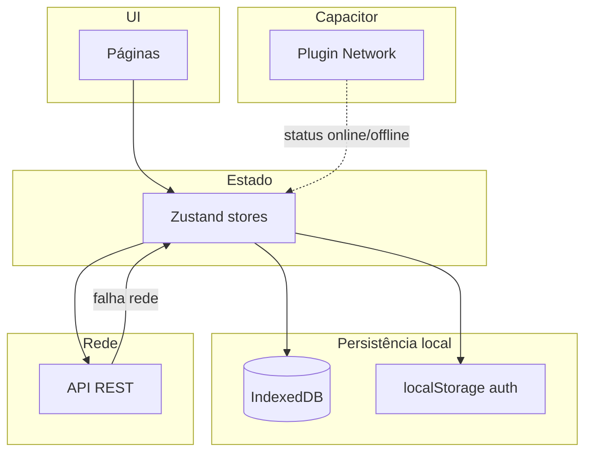

# Plano — App funcional offline (build Android / Capacitor)

**Data:** 10/04/2026  
**Contexto:** SPA Vite + React + Zustand; API remota via Axios; persistência parcial (IndexedDB em `rotasStore`, `localStorage` em auth, persist em `deliveryStore`).  
**Meta:** Após instalar o APK (Capacitor), o vendedor consegue **abrir o app sem internet** e **trabalhar com dados já sincronizados**, com caminho claro para **ações que exigem rede** (fila de sync ou bloqueio explícito).

---

## 1. O que significa “funcionar offline” (escopo)

| Nível | Descrição | Esforço |
|-------|-----------|---------|
| **Mínimo viável** | Abrir app, sessão válida, ver rotas/clientes do dia e status locais de entrega; sem apagar cache ao falhar rede; login **só com rede** | Médio |
| **Operação de campo** | Mínimo + check-in / PDV / cadastros **enfileirados** e enviados ao voltar a rede, com conflitos tratados ou feedback claro | Alto |
| **Paridade web** | PWA + Service Worker para shell na Vercel (opcional; Android APK já embute assets) | Médio |

Este plano assume entrega em **fases**: primeiro **Mínimo viável**, depois **Operação de campo** onde o negócio exigir.

**Fora de escopo inicial:** validar JWT no servidor offline; refresh token sem rede; mudanças de backend (endpoints novos). Tudo que depender de API continua exigindo rede na hora da sincronização.

---

## 2. Diagnóstico resumido (código atual)

**Pontos positivos**

- `rotasStore` persiste `rotas`, `rotasDeHoje`, `clientesRota`, `deliveriesPorRota` no **IndexedDB** (`idb-keyval`), com `skipHydration` e `rehydrate()` após login em `App.tsx`.
- `deliveryStore` persiste `deliveryStatuses`.
- Auth em `localStorage`; `isTokenValid` é local (exp do JWT).

**Riscos para offline**

1. `loadTodaysRoutes` faz `set({ …, clientesRota: [] })` antes do fetch quando `shouldShowLoading` — sem rede, pode **esvaziar** dados já reidratados.
2. **Corrida:** efeitos em `DeliveriesOverview` / `useRotas` podem disparar fetch **antes** de `rehydrate()` concluir → cache parece “vazio” e força rede.
3. Interceptor Axios em `401` limpa sessão e redireciona — correto para sessão inválida; **erros de rede** não devem ser confundidos com 401.
4. Telas que sempre chamam API na montagem (`loadClientesRota`, contratos, produtos, vendas, check-in POST, etc.) **não** têm fallback unificado.
5. Não há **fila de outbox** para POST/PUT falhos — nada é reenviado automaticamente.

---

## 3. Arquitetura alvo (visão)

**Regras de ouro**

1. **Nunca descartar** snapshot local válido antes de substituir por resposta HTTP bem-sucedida.
2. **Esperar hidratação** antes de decidir “preciso buscar na API”.
3. **Distinguir** `sem rede` / `timeout` de `401` / `403` / `4xx` de negócio.
4. Mutações: **gravar intenção local** primeiro, depois **tentar envio**; se falhar por rede, **outbox** + retry.

---

## 4. Fases de implementação

### Fase A — Infraestrutura e contratos (base)

| # | Tarefa | Detalhes |
|---|--------|----------|
| A.1 | `@capacitor/network` (ou equivalente) | Instalar no projeto Capacitor; expor hook `useNetworkStatus()` ou store leve `networkStore` (online / offline / desconhecido). |
| A.2 | Helper `isNetworkError(error)` | Centralizar em `src/shared/api/networkUtils.ts`: `!error.response` + códigos Axios `ERR_NETWORK`, `ECONNABORTED`, etc. |
| A.3 | Documentar `cap sync` / `vite build` | Garantir que `dist` atualizado vai para `android/`; variáveis `API_CONFIG` corretas no build de release. |

**Critério de pronto:** app consegue ler `navigator.onLine` + eventos Capacitor de forma confiável na WebView.

---

### Fase B — Leitura: rotas e entregas (impacto imediato)

| # | Tarefa | Detalhes |
|---|--------|----------|
| B.1 | **Não zerar `clientesRota` no início do load** | Em `loadTodaysRoutes`, remover ou condicionar `clientesRota: []`: só limpar em refresh explícito (`forceRefresh`) ou após sucesso se política de negócio exigir lista “limpa”. Preferência: manter dados anteriores até o novo payload chegar. |
| B.2 | **Gate de hidratação** | Opções (escolher uma): (i) flag `hasHydratedRotas` no store setada no fim de `onRehydrateStorage`; (ii) componente wrapper que não monta `DeliveriesOverview` até `persist.hasHydrated()` / promise de `rehydrate()`; (iii) `loadTodaysRoutes` no-op até `hasHydrated`. |
| B.3 | **Fallback em catch** | Se `isNetworkError` e existir `clientesRota.length > 0` ou `rotasDeHoje.length > 0` persistidos, setar `error` opcional tipo “modo offline” e **manter** estado; não marcar como falha fatal que esvazia UI. |
| B.4 | `loadRotas` / `loadDeliveriesPorRotas` | Mesma filosofia: não degradar cache local em erro de rede; `loadClientesRota` pode servir de `deliveriesPorRota[id]` ou último snapshot antes de chamar API. |
| B.5 | **UI** | Banner discreto “Sem conexão — exibindo dados salvos” quando `offline && dadosEmCache`. |

**Critério de pronto:** fluxo: login online → carregar dados → avião mode → abrir app → lista de entregas/rotas **ainda visível** (mesmo dia, cache válido).

---

### Fase C — Axios e sessão (evitar logout falso)

| # | Tarefa | Detalhes |
|---|--------|----------|
| C.1 | Interceptor de resposta | Em erro: se `isNetworkError`, **não** executar fluxo de 401 (não limpar token, não `window.location`). |
| C.2 | 401 real | Manter comportamento atual (sessão inválida). |
| C.3 | (Opcional) Retry idempotente | GET com 1 retry em falha transitória — só se não complicar rate limit. |

**Critério de pronto:** perda de rede não desloga o usuário nem apaga stores por engano.

---

### Fase D — Outras leituras (por domínio)

Mapear cada tela que faz `useEffect` + API e decidir: **persistir + TTL** ou **obrigatório online**.

| Área | Arquivo / serviço | Ação sugerida |
|------|-------------------|---------------|
| Contratos pendentes | `PendingContracts` + `contratosServices` | Persistir lista + timestamp; mostrar cache offline. |
| Produtos / PDV | `produtosServices` | Cache por distribuidor/dia em IDB (volume pode ser grande — TTL ou versão). |
| Clientes / cadastro | `clientesServices` | Leituras: cache onde existir; criação: Fase E. |
| Histórico / dashboard | conforme uso | Mesmo padrão: snapshot + “dados podem estar desatualizados”. |

**Critério de pronto:** documento de matriz “tela × online obrigatório × cache” preenchido e implementações prioritárias feitas.

---

### Fase E — Mutações: fila de sincronização (operação de campo)

| # | Tarefa | Detalhes |
|---|--------|----------|
| E.1 | Modelo `OutboxItem` | `{ id, type, payload, createdAt, attempts, lastError }` persistido em IndexedDB. |
| E.2 | Tipos iniciais | Ex.: `CHECK_IN`, `VENDA`, `CADASTRO_CLIENTE`, `PAGAMENTO` — alinhar com payloads dos services atuais. |
| E.3 | Wrapper `enqueueMutation` | UI chama função que: aplica otimista no store local; persiste outbox; tenta `flush` se online. |
| E.4 | `flushOutbox` | Ao `online` (evento Capacitor + `focus` app), processar em ordem; backoff em erro; remover item ao 2xx. |
| E.5 | Conflitos | Definir com negócio: ex. check-in duplicado → mensagem; venda → idempotency key se backend suportar; senão, UX de “falha ao enviar”. |

**Critério de pronto:** pelo menos **um** fluxo crítico (ex. check-in ou registro de entrega) funciona offline e sincroniza ao reconectar.

---

### Fase F — UX, testes e release

| # | Tarefa | Detalhes |
|---|--------|----------|
| F.1 | Estados globais | `isOffline`, `isSyncing`, `pendingOutboxCount` na UI (settings ou header). |
| F.2 | Testes manuais Android | Checklist: cold start offline, standby, troca de data (meia-noite), refresh forçado online. |
| F.3 | (Opcional) Testes automatizados | Unit: `isNetworkError`, reducers de outbox; E2E com mock de offline se viável. |
| F.4 | PWA (web) | `vite-plugin-pwa` apenas se quiser paridade com navegador; não bloqueia Android. |

---

## 5. Ordem recomendada e esforço relativo

1. **B + C** — maior ROI para “app abre offline com dados” (2–4 dias úteis, dependendo de QA).  
2. **A** — em paralelo ou logo antes de B (meio dia).  
3. **D** — incremental por sprint conforme telas usadas em campo.  
4. **E** — projeto à parte; cada tipo de mutação é uma entrega (vários dias a semanas).

---

## 6. Riscos e dependências

| Risco | Mitigação |
|-------|-----------|
| Token JWT expira durante dia offline | Avisar na UI; refresh só online; negócio pode aceitar TTL longo no backend |
| `QuotaExceeded` no IDB | Monitorar tamanho de `clientesRota`; compactar ou paginar cache |
| Duplicidade ao reenviar POST | Idempotência no backend ou dedupe por `clientRequestId` |
| WebView antiga | Manter `build.target` conservador (já alinhado no plano de performance Android) |

---

## 7. Checklist pós-implementação (Android)

- [ ] APK instalado; modo avião; abrir app → sessão mantida, lista principal visível.  
- [ ] Modo avião após “dia novo” (edge case) → comportamento definido (mensagem vs último dia).  
- [ ] Reconexão → dados atualizam sem perder outbox.  
- [ ] Logout limpa IDB de rotas/outbox conforme política de privacidade.  

---

## 8. Referências no repositório

- `src/domain/rotas/rotasStore.ts` — cache e loads.  
- `src/App.tsx` — `rehydrate()` do `rotasStore`.  
- `src/presentation/pages/DeliveriesOverview.tsx` — `loadTodaysRoutes`.  
- `src/shared/api/index.ts` — interceptors.  
- `docs/Implementation/plano-otimizacao-android.md` — performance e persistência (contexto).  

---

*Plano vivo: ajustar fases E conforme prioridade do produto e capacidade do backend (idempotência, novos endpoints de sync).*
