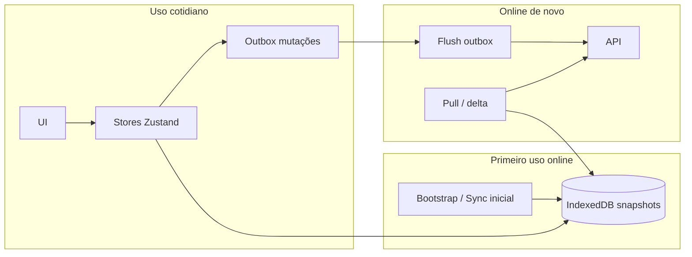

# Plano — Offline-first: primeiro sync, depois app inteiro + atualização ao reconectar

**Data:** 10/04/2026  
**Relacionado:** `plano-offline-android.md` (base já em andamento: cache de rotas, rede, interceptor).

---

## 1. É possível?

**Sim, é possível** arquitetar o app para:

1. **Primeira vez (ou sync explícito)** com rede: baixar um **snapshot** dos dados necessários para operar.
2. **Uso offline:** leituras e fluxos principais servidos do **IndexedDB** (e estado local), sem depender de API na montagem das telas.
3. **Ao voltar online:** **atualizar** snapshot (pull incremental ou full, conforme API) e **enviar** mutações pendentes (fila / outbox).

**Limitações inevitáveis (produto + técnica):**

| Tema | Realidade |
|------|-----------|
| **Login** | Primeiro acesso ou troca de usuário **precisa de rede** (ou fluxo alternativo acordado: PIN local, refresh token longo — decisão de negócio/segurança). |
| **JWT** | Offline não valida token no servidor; após **exp**, só **rede** (ou refresh) reautentica. |
| **“App todo”** | Cada tela/recurso precisa estar mapeado: **dado em IDB** + **escrita na outbox** onde hoje há POST/PUT. Não é só “uma flag”; é **cobertura por feature**. |
| **Conflitos** | Dois dispositivos ou alterações no servidor exigem **regra de negócio** (último vence, versão, bloqueio, merge manual). |
| **Backend** | Ideal: **versionamento / ETag / since**, **idempotência** em POST, ou endpoints de sync. Sem isso, dá para aproximar com **full refresh** e **retry** com cuidado, mas escala pior. |

Conclusão: **é viável** como evolução do projeto atual; o esforço é **alto** e depende de **matriz tela × dados × mutações** + alinhamento com API.

---

## 2. Visão de arquitetura

**Princípios:**

- **Leitura:** UI lê preferencialmente do store já reidratado do IDB; rede **opcional** para “refrescar”.
- **Escrita:** sempre **efeito local imediato** (UX) + registro na **outbox**; envio assíncrono quando online.
- **Sync:** ao detectar online (e opcionalmente periodicamente em foreground), **flush outbox** + **pull** de dados críticos.

---

## 3. O que significa “app todo offline” na prática

Checklist por área (preencher com o time e priorizar):

| Área | Leitura (snapshot no IDB) | Escrita (outbox) |
|------|---------------------------|------------------|
| Rotas / entregas do dia | Já parcial (`rotasStore`) | Check-in, PDV, status — fila |
| Lista de clientes / cadastro | Cache + formulários | POST cliente |
| Contratos pendentes | Persistir lista | Assinaturas / aceites se houver |
| Produtos / PDV | Catálogo por distribuidor/dia | Venda, pagamento |
| Dashboard / histórico | Snapshot ou “última versão” | N/A ou mínimo |

**Definição de pronto “offline-first completo”:** todas as linhas críticas para o vendedor em campo marcadas como implementadas + testes manuais no APK (avião + reconexão).

---

## 4. Fases sugeridas (roadmap)

### Fase 0 — Decisões de produto (curta)

- Login: aceitar **só online** ou desenhar exceção?
- TTL do token vs jornada offline (ex.: 12h vs 7 dias).
- Política de conflito em venda/check-in duplicado.

### Fase 1 — Política de rede única (“sync gateway”)

- Um módulo (ex. `syncStore` ou serviço) que decide: **offline → só IDB**; **online → pull + flush**.
- Unificar “não buscar na API se já temos snapshot válido” **por recurso** (hoje TTL em `rotasStore`; generalizar ou parametrizar).

### Fase 2 — Bootstrap inicial

- Fluxo pós-login: **sync completo** das entidades priorizadas (rotas, clientes do dia, produtos, etc.) com indicador de progresso.
- Persistir `lastFullSyncAt` e opcionalmente `dataVersion` por coleção.

### Fase 3 — Outbox genérico

- Modelo `OutboxItem` (tipo, payload, `clientRequestId`, tentativas, erro).
- `enqueueMutation` + `flushOutbox` ao ficar online + ao `focus` do app (Capacitor).
- Integrar **um** fluxo crítico primeiro (ex.: registro de entrega / check-in), depois expandir.

### Fase 4 — Pull / atualização

- Ao online: para cada coleção, **GET** (delta se API permitir, senão full para conjuntos pequenos).
- Atualizar IDB **sem apagar** dados úteis antes da resposta OK (já alinhado às “regras de ouro” do plano anterior).

### Fase 5 — QA e hardening

- Cold start offline, troca de dia, quota IDB, logout limpando snapshots conforme privacidade.
- Testes automatizados em `isNetworkError`, outbox, reducers.

---

## 5. Dependências de backend (desejável)

- **Idempotência:** header ou body `clientRequestId` em POST críticos.
- **Timestamps ou versão** por recurso para pull incremental.
- Opcional: endpoint de **sync em lote** para reduzir round-trips.

Sem mudanças de API, ainda dá para evoluir com **full reload** por recurso e outbox com retry exponencial — com mais risco de conflito e custo de rede.

---

## 6. Resposta objetiva

| Pergunta | Resposta |
|----------|----------|
| Dá para “baixar na primeira vez e depois usar offline”? | **Sim**, para o conjunto de dados e fluxos que vocês **persistirem e servirem daí**. |
| Dá para “app inteiro” sem exceção? | **Só** se **todas** as telas e mutações forem cobertas por snapshot + outbox; login/token continuam limitados pela segurança. |
| Dá para atualizar ao voltar online? | **Sim**: pull + flush da outbox é o padrão. |

Este documento é o **plano de alto nível**; a execução detalhada continua encaixando nas fases E do `plano-offline-android.md` (outbox) e extensões por domínio (Fase D).

---

*Documento vivo: ajustar prioridades com o backlog e capacidade do backend.*
