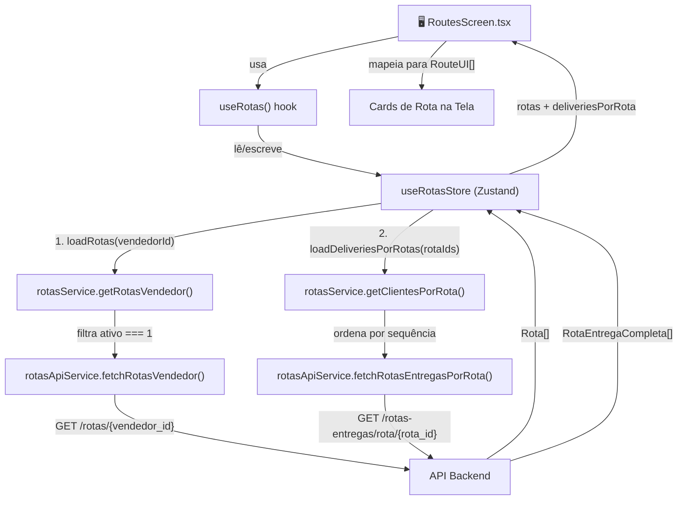
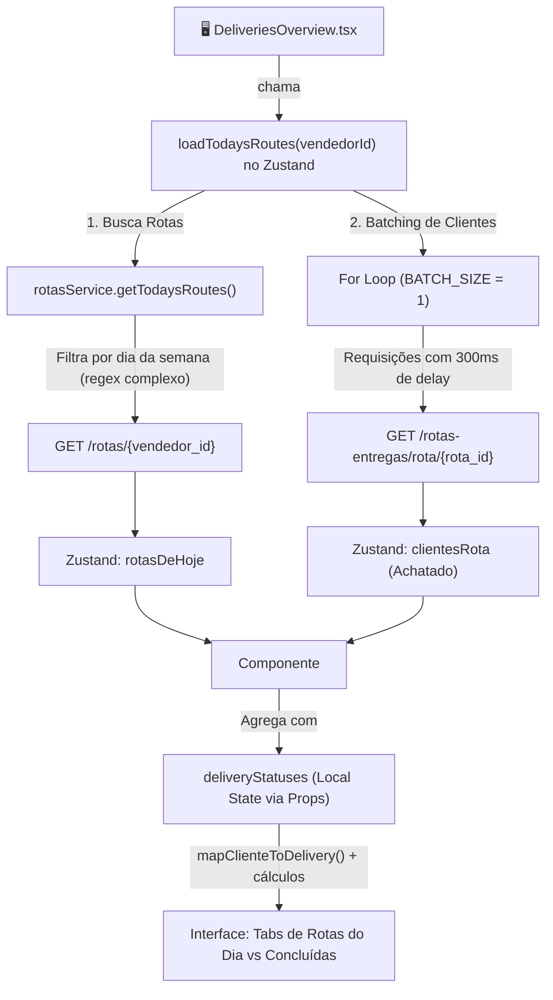
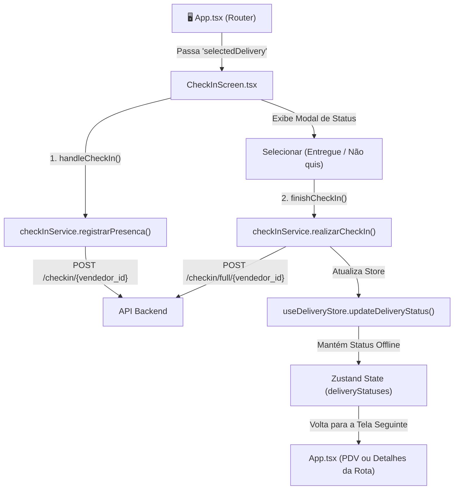
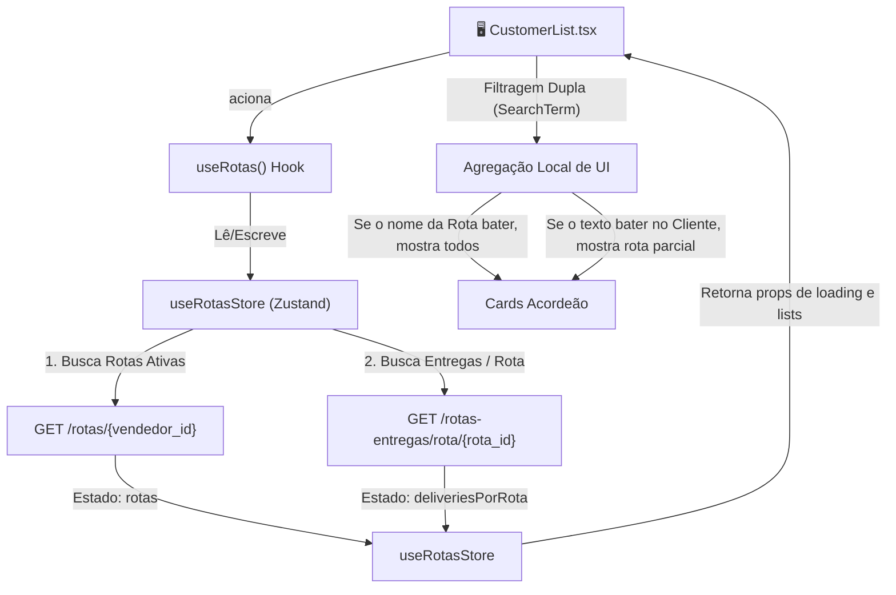
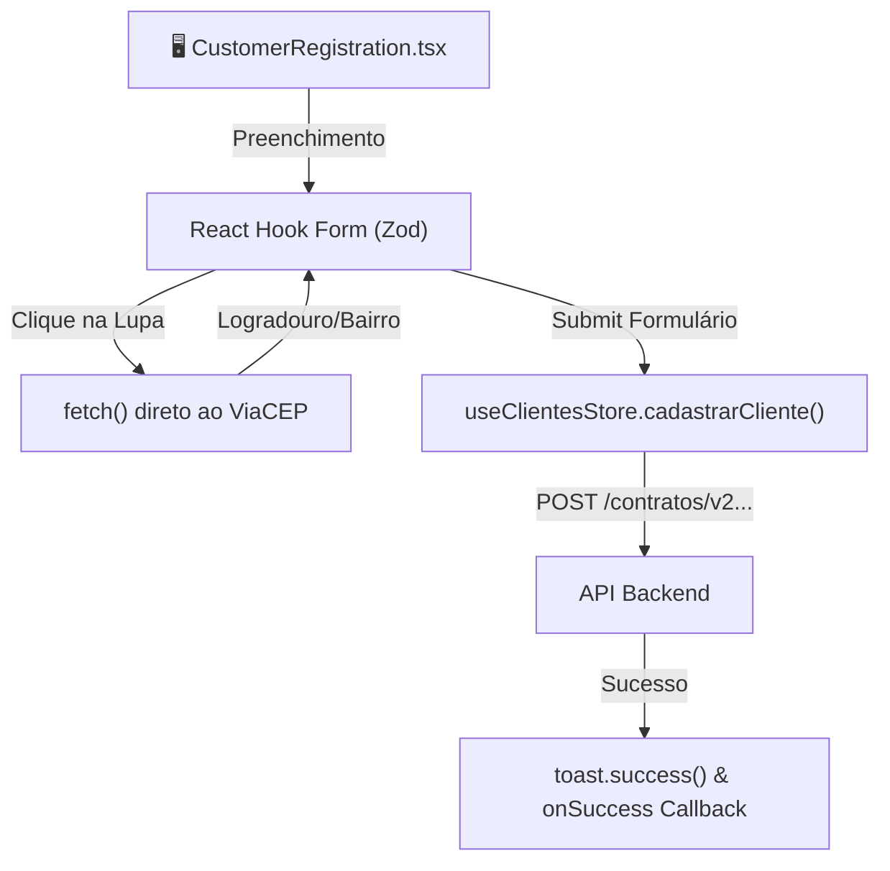
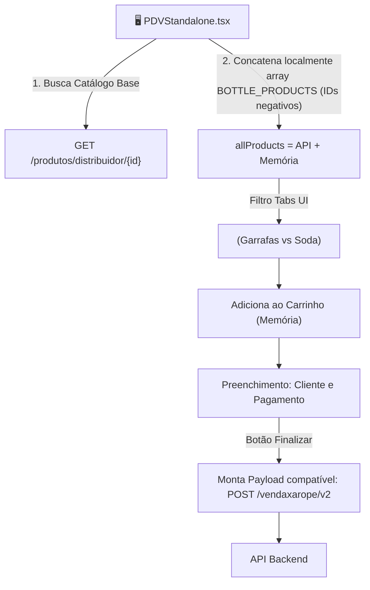

# Data Flow por Página

> Documentação técnica para a equipe entender **quais endpoints são usados**, **como os dados são agregados** e **qual o fluxo completo** em cada página do projeto.

**Última atualização:** 18/03/2026

**POR: Ivan Martins** - Desenvolvedor bystartup

---

## Índice

1. [RoutesScreen](#1-routesscreen)
2. [RouteDetails](#2-routedetails)
3. [DeliveriesOverview](#3-deliveriesoverview)
4. [CheckInScreen](#4-checkinscreen)
5. [CustomerList](#5-customerlist)
6. [CustomerRegistration](#6-customerregistration)
7. [CustomerHistory](#7-customerhistory)
8. [Dashboard (Mock)](#8-dashboard-mock)
9. [LoginScreen](#9-loginscreen)
10. [PDVStandalone](#10-pdvstandalone)
11. [PendingContracts](#11-pendingcontracts)

---

## Glossário

| Termo | Significado |
|-------|-------------|
| **Client-Side Data Aggregation** | Padrão onde o frontend faz múltiplas chamadas a endpoints diferentes e combina/enriquece os dados localmente antes de exibir |
| **Batching Sequencial** | Técnica de enviar requests em lotes de N por vez, com delay entre lotes, para evitar erro `429 Too Many Requests` |
| **Progressive Loading** | UI mostra dados parciais conforme são carregados, sem bloquear a tela inteira |
| **Cache TTL** | Tempo em que os dados em memória são considerados válidos antes de buscar novamente na API |

---

## 1. RoutesScreen

**Arquivo:** [`RoutesScreen.tsx`](file:///c:/bystartup/soda-app/src/presentation/pages/RoutesScreen.tsx)
**Rota no App:** Seleção de rota pelo vendedor

### Usa Client-Side Data Aggregation? ✅ Sim

A tela faz **2 chamadas sequenciais** a endpoints diferentes e combina os resultados no frontend para montar os cards de rota com informação enriquecida.

---

### Endpoints Utilizados

| # | Método | Endpoint | Parâmetro | Retorno | Quando é chamado |
|---|--------|----------|-----------|---------|------------------|
| 1 | `GET` | `/rotas/{vendedor_id}` | `vendedorId` (localStorage) | `Rota[]` | Na montagem do componente |
| 2 | `GET` | `/rotas-entregas/rota/{rota_id}` | `rotaId` de cada rota | `RotaEntregaCompleta[]` | Após o endpoint 1 retornar — chamado **1 vez para cada rota** |

---

### Fluxo de Dados Completo



---

### Detalhamento por Camada

#### 1. Presentation Layer

**Arquivo:** [`RoutesScreen.tsx`](file:///c:/bystartup/soda-app/src/presentation/pages/RoutesScreen.tsx)

- Consome dados via hook `useRotas()`
- Converte `Rota` + `deliveriesPorRota` → `RouteUI[]` (view model local)
- **Enriquecimento no front:**
  - `pendingDeliveries` → `deliveries.length` (contagem de entregas por rota)
  - `zone` → extrai bairro predominante dos clientes via `getZoneFromDeliveries()`
  - `status` → hardcoded como `'pending'` (sem integração com backend para status real)
  - `priority` → hardcoded como `'medium'`

#### 2. Hook Layer

**Arquivo:** [`useRotas.ts`](file:///c:/bystartup/soda-app/src/presentation/hooks/useRotas.ts)

- **`useEffect` 1:** chama `loadRotas(vendedorId)` quando o componente monta
  - `vendedorId` é lido do `localStorage`
- **`useEffect` 2:** quando `rotas` muda (não está vazio), chama `loadDeliveriesPorRotas(rotaIds)`
  - Isso é o **data aggregation**: primeiro busca a lista de rotas, depois enriquece cada uma com entregas

#### 3. Store Layer (Zustand)

**Arquivo:** [`rotasStore.ts`](file:///c:/bystartup/soda-app/src/domain/rotas/rotasStore.ts)

| Ação | Comportamento |
|------|---------------|
| `loadRotas()` | Cache TTL de **5 minutos**. Se cache válido, não faz request. Parâmetro `forceRefresh` ignora cache. |
| `loadDeliveriesPorRotas()` | **Batching sequencial**: 1 request por vez, delay de 300ms entre chamadas. Atualização incremental do estado (UI atualiza progressivamente). Guard contra dupla execução (React StrictMode). Pula rotas já carregadas. |

**Estado relevante:**

```typescript
interface RotasState {
    rotas: Rota[];                                    // Lista de rotas do vendedor
    deliveriesPorRota: Record<number, RotaEntregaCompleta[]>; // Entregas agrupadas por rota_id
    isLoading: boolean;                                // Loading do endpoint 1
    isLoadingDeliveries: boolean;                      // Loading do endpoint 2 (batch)
    loadingProgress: { current: number; total: number } | null; // Progresso do batch
}
```

#### 4. Domain Service Layer

**Arquivo:** [`services.ts`](file:///c:/bystartup/soda-app/src/domain/rotas/services.ts)

- `getRotasVendedor()` → filtra apenas rotas com `ativo === 1`
- `getClientesPorRota()` → ordena clientes por `rotaentrega.sequencia`

#### 5. API Service Layer

**Arquivo:** [`rotasServices.ts`](file:///c:/bystartup/soda-app/src/shared/api/services/rotasServices.ts)

- Chamadas HTTP diretas via Axios (`api.get<T>`)
- Usa endpoints definidos em [`endpoints.ts`](file:///c:/bystartup/soda-app/src/shared/api/endpoints.ts)

---

### Comportamento na UI

| Estado | O que o usuário vê |
|--------|-------------------|
| `isLoading = true` | Tela de loading com spinner animado e texto "Buscando rotas..." |
| `error !== null` | Tela de erro com botão "Tentar Novamente" |
| `isLoadingDeliveries = true` | Cards de rota **já visíveis**, com barra de progresso no topo e texto "Carregando entregas..." nos cards |
| Dados completos carregados | Cards com contagem de entregas, zona predominante, e botão "Ver Detalhes da Rota" |

---

### Estratégia de Performance

> [!TIP]
> **Progressive Loading:** A tela não espera TODAS as entregas carregarem. Os cards aparecem assim que as rotas são carregadas (endpoint 1), e as entregas vão aparecendo incrementalmente conforme cada batch do endpoint 2 retorna.

- **Cache em memória:** 5 minutos para rotas, verificação de IDs já carregados para deliveries
- **Anti-429:** Batching de 1 request + 300ms delay entre chamadas ao endpoint 2
- **Anti-StrictMode:** Guard `if (state.isLoadingDeliveries) return` evita dupla execução

---

### Modelos de Dados

#### `Rota` (do endpoint 1)
```typescript
interface Rota {
    id: number;
    nome: string;
    frequencia: string;    // Ex: "Segunda-Feira", "Seg a Sexta"
    observacao: string;
    ativo: number;         // 1 = ativa
    checkin_fechado: number;
    cidade_id: number;
}
```

#### `RotaEntregaCompleta` (do endpoint 2)
```typescript
interface RotaEntregaCompleta {
    rotaentrega: RotaEntrega;      // sequencia, num_garrafas, rota_id, cliente_id
    cliente: Cliente;               // nome, endereço, bairro, coordenadas GPS...
    rota: Rota;                     // dados da rota
    diassematendimento: string[];   // histórico de dias sem atendimento
    diassemconsumo: string[];       // histórico de dias sem consumo
}
```

#### `RouteUI` (view model local — NÃO é persistido)
```typescript
interface RouteUI extends Rota {
    pendingDeliveries: number;          // calculado: deliveries.length
    priority: 'high' | 'medium' | 'low'; // hardcoded: 'medium'
    status: 'pending' | 'in-progress' | 'completed'; // hardcoded: 'pending'
    zone: string;                       // calculado: bairro mais frequente
}
```

---

### Observações e Pontos de Atenção

> [!WARNING]
> - **`status` e `priority` estão hardcoded.** Não há integração com backend para determinar status real da rota. Todas as rotas aparecem como "Pendente" e prioridade "Média".
> - **`vendedorId` vem do `localStorage`**, não de um store de autenticação. Se o localStorage estiver limpo, nenhuma rota é carregada (sem tratamento de erro para este caso).

> [!NOTE]
> - A função `getZoneFromDeliveries()` calcula a zona predominante contando a frequência de bairros — é uma heurística, não um dado da API.
> - O endpoint `GET /rotas-entregas` (busca todas as rotas de uma vez) existe e está mapeado, mas **não é usado** nesta tela — provavelmente para evitar sobrecarga.

---

## 2. RouteDetails

**Arquivo:** [`RouteDetails.tsx`](file:///c:/bystartup/soda-app/src/presentation/pages/RouteDetails.tsx)
**Rota no App:** `/routes/details`
**Propósito:** Exibir a lista de clientes (entregas) de uma rota selecionada e permitir ações (check-in, PDV, abrir GPS).

### Usa Client-Side Data Aggregation? ✅ Sim (Store cruzada)

A tela combina dados estruturados vindos de duas fontes independentes de estado: 
1. Os clientes da rota, buscados na API (`useRotasStore`).
2. Os status das entregas, gerenciados localmente/em outro store (`useDeliveryStore` via prop `deliveryStatuses`).

Esta agregação é usada para montar os cards de cliente determinando visualmente se a entrega está "Pendente", "Entregue", "Não quis", etc.

---

### Endpoints Utilizados

| # | Método | Endpoint | Parâmetro | Retorno | Quando é chamado |
|---|--------|----------|-----------|---------|------------------|
| 1 | `GET` | `/rotas-entregas/rota/{rota_id}` | `rota.id` | `RotaEntregaCompleta[]` | Somente se a rota recebida via propriedade não possuir `deliveries` populado. Retorna imediatamente se já houver cache. |

---

### Fluxo de Dados Completo

```mermaid
graph TD
    A["🖥️ App.tsx (Router)"] -->|Passa 'selectedRoute' e 'deliveryStatuses'| B["RouteDetails.tsx"]
    
    B -->|Se 'deliveries' vazio| C["useRotasStore.loadClientesRota(rotaId)"]
    C -->|"rotasService.getClientesPorRota()"| D["API Backend: GET /rotas-entregas/rota/{rota_id}"]
    
    D -->|"RotaEntregaCompleta[]"| E["Zustand (clientesRota)"]
    E -->|Ativa React Hook (useEffect)| B
    
    B -->|"mapClienteToDelivery()"| F["Zustand (deliveryStatuses)"]
    F -->|"Status de Check-in"| G["Combinação de Dados"]
    G -->|"Exibição na UI (Delivery[])"| H["Cards de Clientes"]
```

---

### Detalhamento por Camada

#### 1. Presentation Layer
**Arquivo:** [`RouteDetails.tsx`](file:///c:/bystartup/soda-app/src/presentation/pages/RouteDetails.tsx)
- Recebe `route` e `deliveryStatuses` via props.
- Verifica se `route.deliveries` está vazio. Se sim, dispara `loadClientesRota(route.id)`.
- **Mapeamento:** Transforma `RotaEntregaCompleta` (da API/Store) em `Delivery` (View Model) usando a função local `mapClienteToDelivery`.
- Filtra `deliveries` separando em `pendingDeliveries` e `completedDeliveries` usando o objeto `deliveryStatuses`.
- Renderiza componentes: GPS Button, Check-in Modal e botões de re-direcionamento para o PDV.

#### 2. Store Layer (Zustand)
**Arquivos:** [`rotasStore.ts`](file:///c:/bystartup/soda-app/src/domain/rotas/rotasStore.ts) e [`deliveryStore.ts`](file:///c:/bystartup/soda-app/src/domain/deliveries/deliveryStore.ts)
- `loadClientesRota`: Busca clientes únicos para uma rota específica. Se ocorrer erro, gerencia a flag de `error`.
- `deliveryStatuses`: Um dictionary (Record) de estados de check-in indexado pelo id do delivery. Isso evita requests excessivos sempre que o vendedor volta à tela.

#### 3. Domain Service Layer
**Arquivo:** [`services.ts`](file:///c:/bystartup/soda-app/src/domain/rotas/services.ts)
- A tela utiliza a função de domínio genérica `rotasService.calcularPrioridade()` para transformar dados nativos da API (quantidade de garrafas, observação) em uma enumeração UI (`'high'`, `'medium'`, `'low'`).

---

### Observações e Pontos de Atenção

> [!TIP]
> **Otimização Multi-Store:** O uso do cache das rotas via `deliveryStatuses` (passado pelo `App.tsx` via `useDeliveryStore`) indica uma sincronização otimizada para off-line first ou local-first. As ações de Check-in são salvas state-only temporariamente via `updateDeliveryStatus`.

> [!WARNING]
> - O mapeamento para a UI injeta dados sintéticos como `orderId: 'PED-' + id` e `orderCode: 'SCT-' + cliente.id`. Estes não refletem números de pedidos reais no banco, apenas marcadores de interface.
> - O `estimatedTime` da entrega é hardcoded como `new Date()` no exato momento da conversão.

---

## 3. DeliveriesOverview

**Arquivo:** [`DeliveriesOverview.tsx`](file:///c:/bystartup/soda-app/src/presentation/pages/DeliveriesOverview.tsx)
**Rota no App:** `/deliveries` (Home/Default tab)
**Propósito:** Dashboard operacional do vendedor exibindo todas as rotas e clientes alocados para o dia atual. Permite visualização separada entre entregas programadas e rotas já concluídas.

### Usa Client-Side Data Aggregation? ✅ Sim (Heavy Aggregation)

A tela orquestra o carregamento de **todas** as rotas ativas para o dia atual, depois executa carregamento sequencial (batching) dos clientes de cada uma dessas rotas, e por fim cruza tudo isso com o estado offline-first de check-ins locais.

---

### Endpoints Utilizados

| # | Método | Endpoint | Parâmetro | Retorno | Quando é chamado |
|---|--------|----------|-----------|---------|------------------|
| 1 | `GET` | `/rotas/{vendedor_id}` | `vendedorId` | `Rota[]` | Quando o componente é montado (dentro de `loadTodaysRoutes`) |
| 2 | `GET` | `/rotas-entregas/rota/{rota_id}` | Array de `rotaIds` originados do Endpoint 1 | `RotaEntregaCompleta[]` | Chamado em *batching* reativo logo após as rotas do dia serem mapeadas |

---

### Fluxo de Dados Completo



---

### Detalhamento por Camada

#### 1. Presentation Layer
**Arquivo:** [`DeliveriesOverview.tsx`](file:///c:/bystartup/soda-app/src/presentation/pages/DeliveriesOverview.tsx)
- No `useEffect`, dispara `loadTodaysRoutes(vendedorId)`.
- **Mapeamento Pesado:** Processamento de toda a lista de `clientesRota` para convertê-la num objeto de representação visual de deliveries via `mapClienteToDelivery`.
- Filtra a visualização entre "Entregas do Dia" e "Concluídas".
- **Lógica de Status de Rota:** Uma rota só é definida como `'completed'` se o total de `pendingDeliveriesCount` === 0 (calculado no front com base no histórico local `deliveryStatuses`).

#### 2. Store Layer (Zustand)
**Arquivo:** [`rotasStore.ts`](file:///c:/bystartup/soda-app/src/domain/rotas/rotasStore.ts)
- **Ação `loadTodaysRoutes`:** Lida com cache de 5 minutos.
- Processa carregamento progressivo e atualiza `loadingStep` ("rotas" ou "clientes") e `loadingProgress` ({ current, total }).
- Utiliza **delay assíncrono (300ms)** e processamento porotes (batches) de 1 para evitar banimentos por `429 Too Many Requests`.

#### 3. Domain Service Layer
**Arquivo:** [`services.ts`](file:///c:/bystartup/soda-app/src/domain/rotas/services.ts)
- **Resolução de Escalas de Trabalho:** O método `getTodaysRoutes()` possui regras de negócio ricas para parsing das frequencias (ex: reconhece string `Seg a sexta` e relaciona com o índice do dia atual em `new Date()`).

---

### Observações e Pontos de Atenção

> [!TIP]
> **Feedback Visual Assíncrono:** O uso estratégico do estado `loadingProgress` direto na Store Zustand garante uma animação nativa na UI que não trava o navegador enquanto dezenas/centenas de requisições GET ocorrem em background.

> [!WARNING]
> - O cálculo de Zonas é feito **em tempo de renderização**, varrendo clientes repetidas vezes O(n). Isso pode gerar lentidão sutil em dispositivos antigos quando a base tem muitos registros. Em uma tela pesada como a Overview, memorizar (`useMemo`) esse pipeline de mapeamento ajudaria no desempenho.
> - O `deliveryStatuses[id]?.checkInStatus` é a única garantia de completude da rota para a tab "Concluídas". Sincronizações externas não vão jogar rotas para esta tab até que haja um evento manual local do vendedor.

---

## 4. CheckInScreen

**Arquivo:** [`CheckInScreen.tsx`](file:///c:/bystartup/soda-app/src/presentation/pages/CheckInScreen.tsx)
**Rota no App:** `/checkin`
**Propósito:** Registrar a chegada do vendedor ao local do cliente e registrar a decisão do atendimento (entregue com venda, sem venda, ausente, etc.).

### Usa Client-Side Data Aggregation? ❌ Não

A tela não agrega dados recebidos de APIs em listas cruzadas. O foco da tela é 100% **transacional e mutacional**, submetendo ações (Check-ins) em formato de POST e atualizando o estado local (Zustand) temporário. Os dados do cliente provêm unicamente de propriedades repassadas entre telas (`useDeliveryStore`).

---

### Endpoints Utilizados

| # | Método | Endpoint | Parâmetro | Retorno | Quando é chamado |
|---|--------|----------|-----------|---------|------------------|
| 1 | `POST` | `/checkin/{vendedor_id}` | `vendedorId` + Geolocalização na montagem | `void` | Registro de presença inicial assim que o vendedor clica no botão "Enviar Check-in". |
| 2 | `POST` | `/checkin/full/{vendedor_id}` | JSON Complexo do Atendimento | `void` | Na etapa final do check-in quando o vendedor seleciona a finalidade e decide realizar (ou não) venda. |

---

### Fluxo de Dados Completo



---

### Detalhamento por Camada

#### 1. Presentation Layer
**Arquivo:** [`CheckInScreen.tsx`](file:///c:/bystartup/soda-app/src/presentation/pages/CheckInScreen.tsx)
- Exibe a localização inicial simulada (ou real) do dispositivo.
- Possui duas etapas engatilhadas por botões: 
  - `handleCheckIn`: dispara PRESENÇA Inicial e exibe as opções de Status.
  - `finishCheckIn`: dispara CHECK-IN-FULL e fecha o fluxo, chamando um callback de navegação (`onCheckInComplete`).
- Gerencia mock/State local (`lastCheckIns`) com array em memória para listar check-ins recentes do aparelho do usuário (ainda não sincronizado com GET histórico).

#### 2. Store Layer (Zustand)
**Arquivo:** [`deliveryStore.ts`](file:///c:/bystartup/soda-app/src/domain/deliveries/deliveryStore.ts)
- A *Service Layer* (`checkInService.ts`) injeta **diretamente a mutação no store de deliveries** usando `useDeliveryStore.getState().updateDeliveryStatus()`, assegurando que o Check-in fique documentado localmente para que outras telas (DeliveriesOverview, RouteDetails) identifiquem-o instantaneamente sem recarregar da web.

#### 3. Domain Service Layer
**Arquivo:** [`services.ts`](file:///c:/bystartup/soda-app/src/domain/checkin/services.ts)
- `registrarPresenca()`
- `realizarCheckIn(request: CheckInRequest): Promise<void>`

---

### Observações e Pontos de Atenção

> [!WARNING]
> - O array de histórico `lastCheckIns` perde todos os dados se o browser/app atualizar (limpeza de state `useState`), visto que não consulta via API. Ideal para uma versão real seria usar um endpoint GET para a lista de presença.

---

## 5. CustomerList

**Arquivo:** [`CustomerList.tsx`](file:///c:/bystartup/soda-app/src/presentation/pages/CustomerList.tsx)
**Rota no App:** `/customers`
**Propósito:** Exibir a lista de todos os clientes do vendedor, organizados por rota, com funcionalidade de busca profunda e navegação para histórico ou novos cadastros.

### Usa Client-Side Data Aggregation? ✅ Sim (Store Hook)

Semelhante à `RoutesScreen`, esta página delega o carregamento para o hook `useRotas()`, que carrega as rotas e agrupa os clientes em um dictionary `deliveriesPorRota`. O componente então aplica lógica intensa de filtragem client-side (pesquisa hierárquica por strings no nome da rota ou atributos dos clientes).

---

### Endpoints Utilizados

Os mesmos engatilhados por `useRotas()`:

| # | Método | Endpoint | Parâmetro | Retorno | Quando é chamado |
|---|--------|----------|-----------|---------|------------------|
| 1 | `GET` | `/rotas/{vendedor_id}` | `vendedorId` | `Rota[]` | Quando o componente monta (via `useEffect` do hook `useRotas`). |
| 2 | `GET` | `/rotas-entregas/rota/{rota_id}` | Arrays de `rotaIds` originados do Endpoint 1 | `RotaEntregaCompleta[]` | Após Endpoint 1, para cada Rota (batching paralelo via `loadDeliveriesPorRotas`). |

---

### Fluxo de Dados Completo



---

### Detalhamento por Camada

#### 1. Presentation Layer
**Arquivo:** [`CustomerList.tsx`](file:///c:/bystartup/soda-app/src/presentation/pages/CustomerList.tsx)
- **Engine Local de Busca:** Implementa uma busca rica e bidirecional (`matchesSearch` e `clienteMatchesSearch`). Se o usuário busca por "Maria" e exite uma Maria na Rota 3, a Rota 3 aparece exibindo apenas os clientes cujo nome/telefone contenham Maria. Se ele busca por "Rota Comercial", exibe a rota completa com todos os clientes.
- **Formatação de View:** Usa regras locais para exibir tipo de comodato (`getContractLabel`) baseado inteiramente na leitura de substrings do campo observação, e qual tipo de garrafa (`getProductLabel`) checando flags booleanas.

#### 2. Domain Services / Hooks Layer
**Arquivo:** [`useRotas.ts`](file:///c:/bystartup/soda-app/src/presentation/hooks/useRotas.ts)
- Age como Middleware, abstraindo da página os métodos de delegação e gerenciamento da rotina multi-endpoint. Reduz o boilerplate na componentização, unificando retornos em `rotas`, `deliveriesPorRota`, e progresso de load.

---

### Observações e Pontos de Atenção

> [!WARNING]
> - O `CustomerList` depende do hook genérico `useRotas()`. Isto significa que a busca de clientes de cada rota é feita em modo de batching paralelo `loadDeliveriesPorRotas` e NÃO o método assíncrono sequencial atrasado usado em `loadTodaysRoutes`. Redes fracas ou vendedores com centenas de rotas podem ter interrupção por gargalos de Requests simultâneos.
> - O `getContractLabel` confia na string livre do campo `observacao` do cliente (ex: procura `.includes('Semanal')`) em vez de chaves ou ENUMs estruturados, o que o torna frágil caso back-office digite "Semana" ou "semanal".

---

## 6. CustomerRegistration

**Arquivo:** [`CustomerRegistration.tsx`](file:///c:/bystartup/soda-app/src/presentation/pages/CustomerRegistration.tsx)
**Rota no App:** `/customers/new`
**Propósito:** Formulário de cadastro de novos clientes, com integração de busca de CEP e regras padrão de novo comodato.

### Usa Client-Side Data Aggregation? ❌ Não

Trata-se de um formulário transacional alimentado pelo usuário e gerenciado pelo React Hook Form + Zod.

---

### Endpoints Utilizados

| # | Método | Endpoint | Parâmetro | Retorno | Quando é chamado |
|---|--------|----------|-----------|---------|------------------|
| 1 | `GET` | `https://viacep.com.br/ws/{cep}/json/` | `cep` | Dados de Endereço | Ao clicar na lupa "Buscar CEP" |
| 2 | `POST` | `/contratos/v2/cadastro-de-clientes` | Payload do Form (`ClienteCadastroPayload`) | `boolean` de sucesso | No submit do formulário via ação do Zustand (`cadastrarCliente`). |

---

### Fluxo de Dados Completo



---

### Detalhamento por Camada

#### 1. Presentation Layer
**Arquivo:** [`CustomerRegistration.tsx`](file:///c:/bystartup/soda-app/src/presentation/pages/CustomerRegistration.tsx)
- Abundante uso do `useForm` (React Hook Form) para validação síncrona visual usando esquema `Zod` exportado de `models.ts`.
- Valores `default` sensíveis setados previamente (Ex: `tipo_cadastro: 1`, `vendedorId` da sessão em andamento, `cf_agua: true`).
- A busca do ViaCEP é feita em um adapter fetch "solto" no front, não aciona o Axios Global nem a Store.

#### 2. Store Layer (Zustand)
**Arquivo:** [`clienteStore.ts`](file:///c:/bystartup/soda-app/src/domain/clientes/clienteStore.ts)
- Apenas a injeção do comando `cadastrarCliente` que despacha assincronamente a mutação, e uma flag `isSubmitting` vinculada ao estado do botão na UI.

---

### Observações e Pontos de Atenção

> [!WARNING]
> - A chamada de CEP não utiliza o `httpClient` (Axios) do projeto, mas sim um `fetch` nativo com URL hardcoded na interface (bypass na estrutura `endpoints.ts`). O ideal é migrar isto para a chamada declarada em `endpoints.cep(cep)`.
> - Os campos Cidade e UF não são recebidos pela API de cadastro `Soda Cristal v2`, então após buscar o CEP, apenas Bairro e Logradouro são mapeados (conforme os campos definidos no Payload e a limitação do endpoint).

---

## 7. CustomerHistory

**Arquivo:** [`CustomerHistory.tsx`](file:///c:/bystartup/soda-app/src/presentation/pages/CustomerHistory.tsx)
**Rota no App:** Não tem URL fixa (é renderizado dentro de Modals/Sheets ou empilhado visualmente passando `customer` via props).
**Propósito:** Exibir o histórico cronológico de compras (vendas concluídas) de um cliente específico.

### Usa Client-Side Data Aggregation? ✅ Sim (Filtering pesado na memória)

O componente não busca o histórico de um cliente específico na API. Em vez disso, ele baixa o histórico de **todas** as vendas daquele vendedor logado e realiza a filtragem na memória do browser.

---

### Endpoints Utilizados

| # | Método | Endpoint | Parâmetro | Retorno | Quando é chamado |
|---|--------|----------|-----------|---------|------------------|
| 1 | `GET` | `/vendas_vendedor/{vendedorId}` | `vendedorId` da sessão em andamento (`useUserStore`) | `VendaVendedor[]` | No mount do componente, dentro do `useEffect`. |

---

### Fluxo de Dados Completo

```mermaid
graph TD
    A["🖥️ CustomerHistory.tsx (recebe prop 'customer')"] -->|Busca Histórico do Vendedor| B["vendasService.getVendasVendedorHistorico()"]
    
    B -->|"GET /vendas_vendedor/{vendedorId}"| C["API Backend"]
    C -->|"1000+ Registros de Venda"| B
    
    B -->|Array Completo de Vendas| D["Frontend: Array.filter()"]
    D -->|"v.cliente_id === customer.id"| E["Frontend: Array.sort() por data_venda DESC"]
    
    E -->|Array Final (5-20 registros)| F["Interface Renderiza os Cards"]
```

---

### Detalhamento por Camada

#### 1. Presentation Layer
**Arquivo:** [`CustomerHistory.tsx`](file:///c:/bystartup/soda-app/src/presentation/pages/CustomerHistory.tsx)
- O componente executa o parsing assíncrono de String para Date com um helper próprio (`parseDataVenda` de `"dd-MM-yyyy HH:mm:ss"` para formato aceito pelo JS).
- Executa a filtragem `vendas.filter(v => v.cliente_id === customer.id)`.
- É um componente "burro" de estado local: ele não armazena as vendas numa Store Zustand, preserva apenas num state isolado (`history`).

#### 2. Domain Service Layer
**Arquivo:** [`vendasServices.ts`](file:///c:/bystartup/soda-app/src/domain/vendas/services.ts)
- Age como mediador de rede simples, devolvendo a Promise inteira do JSON da API para o frontend processar.

---

### Observações e Pontos de Atenção

> [!WARNING]
> - O endpoint atual baixa o histórico do *vendedor inteiro*. Conforme a base de dados cresce e os meses passam, o array de resposta vai gerar sobrecarga de RAM no dispositivo mobile (Data Fetching ineficiente). O ideal para o futuro seria usar/criar um endpoint paginado como `GET /vendas/cliente/{clienteId}?page=1` para reduzir a banda e o processamento de Array Filter.
> - O Helper `parseDataVenda` é usado intensivamente dentro de `Array.sort`, o que divide strings pesadamente na thread principal durante comparações. Se o array for muito longo, pode gerar pequenos "engasgos" na UI do celular.

---

## 8. Dashboard (Mock)

**Arquivo:** [`Dashboard.tsx`](file:///c:/bystartup/soda-app/src/presentation/pages/Dashboard.tsx)
**Rota no App:** Não listada ativamente no `App.tsx` (Possivelmente um componente legado ou em construção).
**Propósito:** Exibir um resumo do dia do vendedor com cards estatísticos e lista mista de entregas de rotas.

### Usa Client-Side Data Aggregation? ❌ Não (Dados Estáticos)

Atualmente, este componente é **100% mockado**. Não há chamadas de API nem consumo do Zustand Store, apenas um array constante declarado no escopo do React com dados fictícios de exemplo (ex: "João Silva", "Recarga Água com Gás").

---

### Endpoints Utilizados

| # | Método | Endpoint | Parâmetro | Retorno | Quando é chamado |
|---|--------|----------|-----------|---------|------------------|
| / | / | / | / | / | Nenhuma chamada HTTP é realizada. |

### Observações e Pontos de Atenção

> [!NOTE]
> - O `Dashboard` real em produção na verdade foi substituído pela tela `DeliveriesOverview` ou não está sendo importado de fato. O código de `Dashboard.tsx` atual deve ser considerado como Boilerplate de UI.

---

## 9. LoginScreen

**Arquivo:** [`LoginScreen.tsx`](file:///c:/bystartup/soda-app/src/presentation/pages/LoginScreen.tsx)
**Rota no App:** `/login`
**Propósito:** Autenticação dos usuários/vendedores para acesso à plataforma.

### Usa Client-Side Data Aggregation? ❌ Não

A tela de login atua puramente como "catraca" de entrada com requisição única de POST.

---

### Endpoints Utilizados

| # | Método | Endpoint | Parâmetro | Retorno | Quando é chamado |
|---|--------|----------|-----------|---------|------------------|
| 1 | `POST` | `/vendedores/login` | Credenciais (User/Pass) | Token Auth e Payload do Vendedor | Ao clicar em "Entrar" (Submissão de Form nativa). |

---

### Fluxo de Dados Completo

```mermaid
graph TD
    A["🖥️ LoginScreen.tsx"] -->|submit(user, pass)| B["useUserStore.login()"]
    
    B -->|Requisição| C["authService.login()"]
    C -->|"POST /vendedores/login"| D["API Backend"]
    
    D -->|Sucesso (Token)| E["Armazena no Axios Auth Header"]
    D -->|Sucesso (ID)| F["Local Storage & Zustand State"]
    
    F -->|Redirecionamento automático| G["App.tsx Router desbloqueia rotas protegidas"]
```

---

### Detalhamento por Camada

#### 1. Presentation Layer
**Arquivo:** [`LoginScreen.tsx`](file:///c:/bystartup/soda-app/src/presentation/pages/LoginScreen.tsx)
- Coleta os parâmetros por states simples de formulário (`user`, `password`).
- Chama a função `login` importada direto do objeto Zustand em `useUserStore`.
- Mostra erros diretamente consumindo o state reativo de `error` da Store, sem instanciar `try/catch` visual pesados ou `Toasts`.

#### 2. Store Layer (Zustand)
**Arquivo:** [`userStore.ts`](file:///c:/bystartup/soda-app/src/domain/auth/userStore.ts)
- Trata toda a persistência da Sessão. Se positivo, salva `token` e `vendedorId` no `localStorage` do navegador do dispositivo e injeta o `Bearer Token` nativamente na configuração do Axios.

---

### Observações e Pontos de Atenção

> - O login não decifra hierarquia de papéis no Frontend (RBAC) porque o App é desenhado focando 100% no Perfil Vendedor Móvel. A inteligência de proteção reside no Token retornado pelo endpoint.

---

## 10. PDVStandalone

**Arquivo:** [`PDVStandalone.tsx`](file:///c:/bystartup/soda-app/src/presentation/pages/PDVStandalone.tsx)
**Rota no App:** `/pdv` (Pode ser acessado com ou sem contexto de entrega pré-carregada via prop `delivery`)
**Propósito:** Interface Ponto de Venda projetada para criar um carrinho e submeter compras tanto para novos clientes "avulsos" quanto de clientes agendados em rota.

### Usa Client-Side Data Aggregation? ✅ Sim (Catálogo Híbrido)

A tela implementa Aggregation fundindo informações remotas e estáticas: Combina um array em memória com **"Produtos Estáticos/Virtuais"** (Ex: *Garrafa Reposição e Garrafa Vendida* com IDs negativos) junto da listagem baixada da API (*Catálogo Soda/Xaropes* com IDs positivos). Uma tela, duas realidades, um mesmo fluxo de submissão.

---

### Endpoints Utilizados

| # | Método | Endpoint | Parâmetro | Retorno | Quando é chamado |
|---|--------|----------|-----------|---------|------------------|
| 1 | `GET` | `/produtos/distribuidor/{id}` | `distribuidorId` (da Store Auth) | `Produto[]` | No montagem via `useEffect` (catálogo principal de produtos). |
| 2 | `GET` | `/meios_pagamento/{id}` | `distribuidorId` (da Store Auth) | `MeioPagamento[]` | Simulado no load inicial (opções que carregam no Dropdown). |
| 3 | `POST` | `/vendaxarope/v2` | Payload Complexo `Venda[]` | Sucesso Venda | Ao clicar em "Finalizar Venda" montando as contagens do carrinho. |

---

### Fluxo de Dados Completo



---

### Detalhamento por Camada

#### 1. Presentation Layer
**Arquivo:** [`PDVStandalone.tsx`](file:///c:/bystartup/soda-app/src/presentation/pages/PDVStandalone.tsx)
- O `cart` é 100% armazenado num state isolado da UI. A cada render, o sistema calcula `.reduce()` no state local para exibir o Total R$ da Venda.
- Utiliza a propriedade `selectedCategory` para filtrar qual fonte os cards mostram:
  - `Garrafas`: Lê todos os items onde ID < 0 (fictício, provenientes de const estática).
  - `Soda`: Lê os items proveninentes do axios/API.
- Cria IDs Temporários baseados em `Date.now()` nos nós filhos e netos do payload `Venda[]` enviado pelo POST pois a infra `Soda Cristal` repassa ao backend o processamento da inserção.

#### 2. Domain Service Layer
**Arquivo:** [`produtos/services.ts` e `pagamentos/services.ts`]
- Os métodos de domínio gerenciam a tipagem dos adaptadores e repassam do Axios para listagens simples, sem manipulação robusta de lógicas pesadas.

---

### Observações e Pontos de Atenção

> [!WARNING]
> - **Preços Fixos Hardcoded:** A constante `BOTTLE_PRODUCTS` tem seus valores de repasse inseridos manualmene no script `.tsx` (Valor "28.00" por uma Garrafa). Quando a tabela nacional de preços alterar, o repositório terá que ser recomitado se os produtos virtuais continuarem declarados lá e não vierem do mesmo Endpoint de Produtos.
> - O ID do distribuidor que a API espera para Produtos é normalizado temporariamente anexando um zero `Number(distribuidorId + "0")` porque o Backend não bate de igual com a Session.
> - O estado `customerName` aceita qualquer String livre da UI se não for acionado via Entrega (Delivery). Esta string aberta pode resultar em inconsistência no painel B.I de Backoffice posteriormente (Cliente chamado "o rapaz da rua debaixo" ao invés dum ID persistente).

---

## 11. PendingContracts

**Arquivo:** [`PendingContracts.tsx`](file:///c:/bystartup/soda-app/src/presentation/pages/PendingContracts.tsx)
**Rota no App:** `/contracts` (Geralmente Sidebar / Header menu)
**Propósito:** Listar as assinaturas de contrato pendentes de clientes novos criados pelo vendedor ou rejeitados pelo Back-office.

### Usa Client-Side Data Aggregation? ❌ Não

A tela exibe uma lista linear pura retornada do Backend, apenas dividindo a Array com um `filter()` nativo em "Assinados" (`status === 'signed'`) e "Pendentes" (Para UI Split View).

---

### Endpoints Utilizados

| # | Método | Endpoint | Parâmetro | Retorno | Quando é chamado |
|---|--------|----------|-----------|---------|------------------|
| 1 | `GET` | *(Via Axios ApiService)* | `vendedorId` da sessão em andamento (`useUserStore`) | `PendenciaContrato[]` | No montagem via `useEffect`. |

---

### Fluxo de Dados Completo

```mermaid
graph TD
    A["🖥️ PendingContracts.tsx"] -->|Aciona Busca| B["contratosApiService.fetchPendenciasContrato()"]
    
    B -->|"GET /..."| C["API Backend"]
    C -->|Array Resposta| A
    
    A -->|Array.filter(status === signed)| D["UI: Card de 'Assinados'"]
    A -->|Array.filter(status !== signed)| E["UI: Lista 'Pendências / Rejeições'"]
```

---

### Detalhamento por Camada

#### 1. Presentation Layer
**Arquivo:** [`PendingContracts.tsx`](file:///c:/bystartup/soda-app/src/presentation/pages/PendingContracts.tsx)
- Abstrai a lista completa em duas constantes visuais locais (`pendingContracts` e `signedContracts`), e mapeia as recusas/motivos no Card vermelho.
- Possui um Mock de ação num botão `Resolver Pendência` (lança apenas um Toast "em breve").

#### 2. Service API Layer
**Arquivo:** [`contratosServices.ts`]
- Exporta tanto a tipagem (`PendenciaContrato`) quanto executa uma Promise direta de comunicação Axios.

---
*Este documento detalhou como o frontend orquestra, cruza e despacha dados entre Componentes e Camada de Domínio, encerrando a cobertura das principais telas transacionais da v1.*

