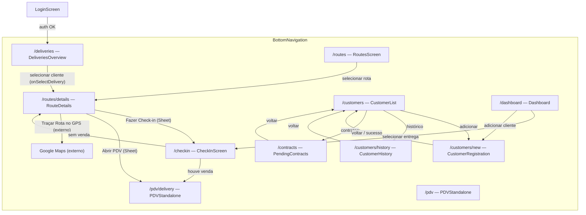

# Fluxos de Páginas — Soda Cristal App

> Documento gerado a partir da análise de `src/presentation/pages` e `App.tsx`.
> Última atualização: 20/02/2026

---

## Visão Geral

A navegação é gerenciada via **React Router DOM** no [App.tsx](file:///c:/bystartup/soda-app/src/App.tsx), com uma `BottomNavigation` fixa. São **5 fluxos principais** + 1 legado.

---

## Fluxos Detalhados

### 1. 🔐 Autenticação

`LoginScreen` → `/deliveries`

- Se `isLoggedIn === false`, renderiza [LoginScreen.tsx](file:///c:/bystartup/soda-app/src/presentation/pages/LoginScreen.tsx) fora do router.
- Após login, o estado muda via `useUserStore` e o app renderiza as rotas autenticadas.
- A rota `/` redireciona automaticamente para `/deliveries`.

---

### 2. 🚚 Entregas (Fluxo Principal)

`DeliveriesOverview` → `RouteDetails` → `CheckInScreen` → `PDVStandalone`

| Rota | Página | Ação |
|------|--------|------|
| `/deliveries` | [DeliveriesOverview.tsx](file:///c:/bystartup/soda-app/src/presentation/pages/DeliveriesOverview.tsx) | Lista entregas da rota do dia. Selecionar cliente → `/routes/details` |
| `/routes/details` | [RouteDetails.tsx](file:///c:/bystartup/soda-app/src/presentation/pages/RouteDetails.tsx) | Detalha todos os clientes da rota. Ações via Sheet: **Check-in** → `/checkin`, **PDV** → `/pdv/delivery`. Botão GPS abre Google Maps. |
| `/checkin` | [CheckInScreen.tsx](file:///c:/bystartup/soda-app/src/presentation/pages/CheckInScreen.tsx) | Check-in. Com venda → `/pdv/delivery`, sem venda → `/routes/details` |
| `/pdv/delivery` | [PDVStandalone.tsx](file:///c:/bystartup/soda-app/src/presentation/pages/PDVStandalone.tsx) | PDV contextual. Voltar → `/routes/details` |

#### DeliveriesOverview — Detalhes de Implementação

- **Fonte de dados**: `useRotasStore` → `loadTodaysRoutes(vendedorId)` — dados reais da API.
- **Adapter interno**: `mapClienteToDelivery(RotaEntregaCompleta → Delivery)` converte o modelo de domínio `rotas` para o modelo `deliveries` usado na UI. Inclui `latitude` e `longitude` do cliente.
- **Tabs**:
  - `Rota de Hoje` — clientes **sem** `checkInStatus` registrado (pendentes).
  - `Realizados` — clientes **com** `checkInStatus`, ordenados do mais recente.
- **Cards de resumo**: contagem de Clientes pendentes, Realizados e total de Garrafas.
- **Click no card**: dispara `onSelectDelivery(delivery, routeDeliveries)` onde `routeDeliveries` são **todas as entregas da mesma rota** (`routeName`), permitindo que `RouteDetails` exiba a lista completa.
- **Formatação**: telefone exibido via `formatPhone()` de `shared/utils/formatters`.
- **Estados visuais do card**: badge colorido por `checkInStatus` (`delivered`, `no-sale`, `absent-return`, `absent-no-return`).

#### RouteDetails — Detalhes de Implementação

- **Fonte de dados**: `route.deliveries` passado pelo componente pai (vem de `onSelectDelivery`). Não faz chamada de API direta.
- **Enumeração**: cada card exibe o número de ordem (índice + 1) do cliente na rota.
- **Botão "Traçar Rota no GPS"**: presente em todo card. Abre `Google Maps` via URL:
  - Com `lat`/`lng` → `maps/dir/?destination=lat,lng`
  - Sem coordenadas → `maps/search/?query=endereço` (fallback por texto)
- **Ações do Cliente** (Bottom Sheet — `<Sheet side="bottom">`): exibido apenas para clientes **sem** `checkInStatus`. Contém:
  - **Fazer Check-in** → chama `onCheckIn(delivery)` → navega para `/checkin`
  - **Abrir PDV** → chama `onOpenPDV(delivery)` → navega para `/pdv/delivery`
- **Formatação**: telefone exibido via `formatPhone()` de `shared/utils/formatters`.
- **Clientes concluídos**: exibem badge do status (cor e ícone) no lugar do Sheet de ações.

---

### 3. 🗺️ Rotas

`RoutesScreen` → `RouteDetails` → (sub-fluxos de check-in/PDV)

| Rota | Página | Ação |
|------|--------|------|
| `/routes` | [RoutesScreen.tsx](file:///c:/bystartup/soda-app/src/presentation/pages/RoutesScreen.tsx) | Lista rotas. Selecionar → `/routes/details` |

> [!NOTE]
> `RouteDetails` detecta a origem (entrega individual via `DeliveriesOverview` vs. rota completa via `RoutesScreen`) para decidir o destino do botão "voltar".

---

### 4. 👥 Clientes

`CustomerList` → `CustomerRegistration` / `CustomerHistory` / `PendingContracts`

| Rota | Página | Ação |
|------|--------|------|
| `/customers` | [CustomerList.tsx](file:///c:/bystartup/soda-app/src/presentation/pages/CustomerList.tsx) | Lista clientes |
| `/customers/new` | [CustomerRegistration.tsx](file:///c:/bystartup/soda-app/src/presentation/pages/CustomerRegistration.tsx) | Cadastro. Voltar/Sucesso → `/customers` |
| `/customers/history` | [CustomerHistory.tsx](file:///c:/bystartup/soda-app/src/presentation/pages/CustomerHistory.tsx) | Histórico de pedidos. Voltar → `/customers` |
| `/contracts` | [PendingContracts.tsx](file:///c:/bystartup/soda-app/src/presentation/pages/PendingContracts.tsx) | Contratos pendentes. Voltar → `/customers` |

---

### 5. 💰 PDV Standalone

| Rota | Página |
|------|--------|
| `/pdv` | [PDVStandalone.tsx](file:///c:/bystartup/soda-app/src/presentation/pages/PDVStandalone.tsx) | PDV independente, sem contexto de entrega |

---

### 6. 📊 Dashboard (secundário/legado)

| Rota | Página | Ação |
|------|--------|------|
| `/dashboard` | [Dashboard.tsx](file:///c:/bystartup/soda-app/src/presentation/pages/Dashboard.tsx) | Selecionar entrega → `/checkin`, Adicionar cliente → `/customers/new` |

---

## ⚠️ Páginas Órfãs

As seguintes páginas existem em `src/presentation/pages` mas **não estão conectadas** a nenhuma rota no `App.tsx`:

| Arquivo | Observação |
|---------|------------|
| [PDVSale.tsx](file:///c:/bystartup/soda-app/src/presentation/pages/PDVSale.tsx) | Substituído pelo `PDVStandalone`. Candidato a remoção. |
| [DeliveryCheckIn.tsx](file:///c:/bystartup/soda-app/src/presentation/pages/DeliveryCheckIn.tsx) | Substituído pelo `CheckInScreen`. Candidato a remoção. |
